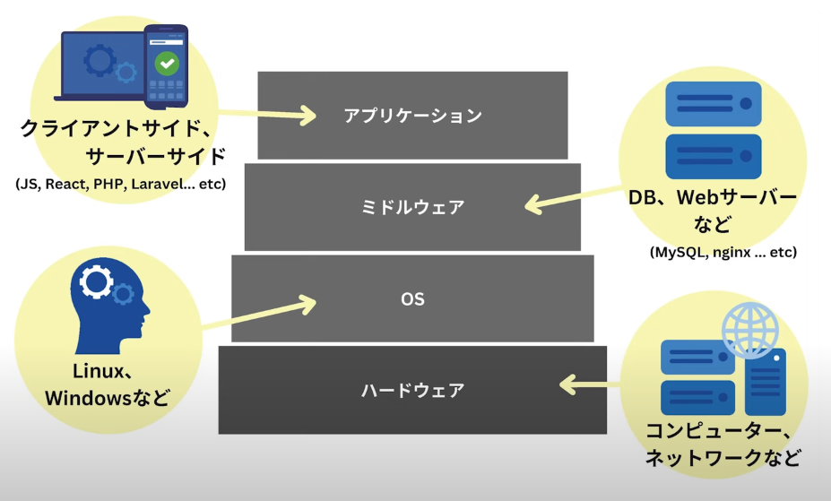

## Dockerが必要な理由

+ 環境構築時間の削減
+ アプリ実行環境の品質向上
+ 自動化ソフトとの相性

## インフラのコード化

コードとして管理 & 同一環境構築

## 覚えるべき

+ Image
  + Dockerコンテナの動作環境となるテンプレートファイル
  + タグを付けないと最新バージョンがインストールされるので注意
  + docker pull ubuntu:18.04
+ DockerFile
  + Dockerイメージをコード化したもの
+ Container
  + 隔離された空間
  + 実行中のイメージ
  + Dockerはコンテナー技術の一つ
+ Compose
  + 複数のコンテナー起動

## 流れ

Dockerfile -> build -> Docker Image -> Run -> Docker container

## 仮想マシンとDockerの違い

|  | Docker | 仮想環境 |
| ---- | ---- | ---- |
| 存在場所 | メモリ上 | ディスク上 |
| ゲストOS | ゲスト OS 存在なし | ホストOSと ゲストOSに 別れる |
| データ管理 | 一時的保管 | 永久保管 |
| コード化 | Dockerfileで管理 | 不可 |