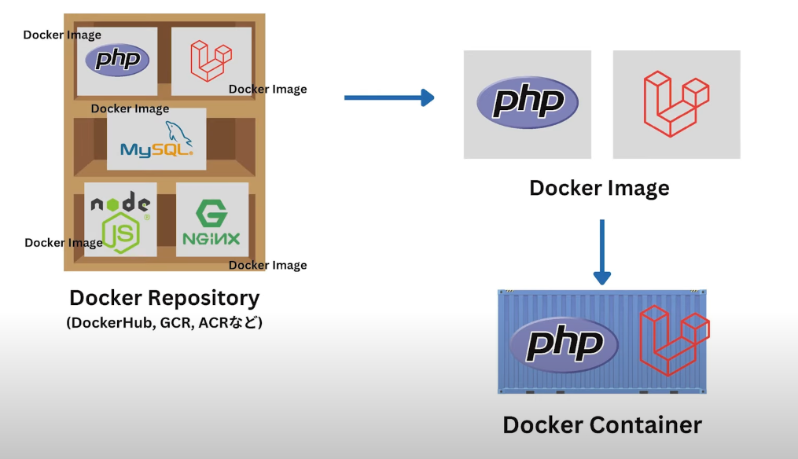

## docker login

+ docker hubにログイン
+ ログインしないと制限がある場合もある

## ◽️image操作コマンド

### docker run

+ docker imageを実行してcontainer起動
+ imageがない場合はdocker hubで取得
+ docker run hello-world

### よく使われるオプションは以下

+ --name
  + コンテナーに任意の名前を与える
  + docker run --name hello-udemy hello-world
+ --rm
  + プロセスが終了されたらコンテナー削除
  + オプションなしなら、普通は停止
  + docker run --name hello-udemy --rm hello-world
+ --volume
  + コンテナーにホストディレクトリをマウント
  + docker run -v /User/kim/source:/var/www/html [image name]
+ -it
  + コンテナーの中に入る
  + docker run -it --name mycentos centos:8 /bin/bash
+ -p
  + コンテナーにアクセスためのポートを解放
  + docker run --name mynginx -p 8080:80 nginx:1.16
+ --env
  + 環境変数(DBのパスワードなど)を渡す

### docker images

+ 現在ローカルのイメージを確認

### docker rmi

+ イメージ削除
+ 実行中のイメージは削除不可
+ 先にコンテナーから削除すべき
+ 依存関係がある場合削除不可

### docker build

+ Dockerfileをイメージにビルド
+ docker buils [フォルダ名]

### docker inspect

+ docker 詳細情報 出力
+ docker inspect mycentos

### docker pull

+ docker imageをダウンロード
+ php pull php:8.0
+ pull後ろに*を付けるとプライベートのイメージがダウンロード出来る

### docker commit

+ コンテナーをイメージ化
+ 何かをコンテナーで追加レイヤーを作った後にイメージかをしたい場合
+ docker commit mycentos hubId/imageName:v1

### docker push

+ docker hubへイメージpush
+ docker push hubId/imageName:v1

### docker history

+ イメージの履歴を確認

## ◽️container操作コマンド

## docker ps

+ 起動中のcontainerを表示
+ 停止中のcontainerは表示されないため、-aオプションが必要

## docker start/stop/restart

+ コンテナー起動
+ docker start
+ docker start mycentos

## docker exec

+ コンテナー中のコマンドライン(bash/zsh)にアクセスする
+ docker exec -it mycentos /bin/bash
  + 中に入って cat /etc/redhat-release　でバージョンを確認出来る
+ docker exec -it mycentos cat /etc/redhat-release
  + こうすると、コンテナー中に入らなくてもバージョン確認が出来る

## docker rm

+ 停止中のコンテナー削除
+ -fで実行中のコンテナー削除出来る

## docker cp

+ コンテナーとホストマシンとのファイルやりとりをするコピーコマンド
+ logファイルや設定ファイルなど渡す
+ docker cp command/sample.txt mycentos:/opt
+ docker cp mycentos:/opt/container.txt /Users/kim/

## docker logs

+ 実行中のコンテナーを監視する(windowを二つ開いて、一つは実行、もう一つはログを監視)
+ docker logs mycentos
+ -fを使うとフォーグラウンド状態になってリアルタイム監視になる