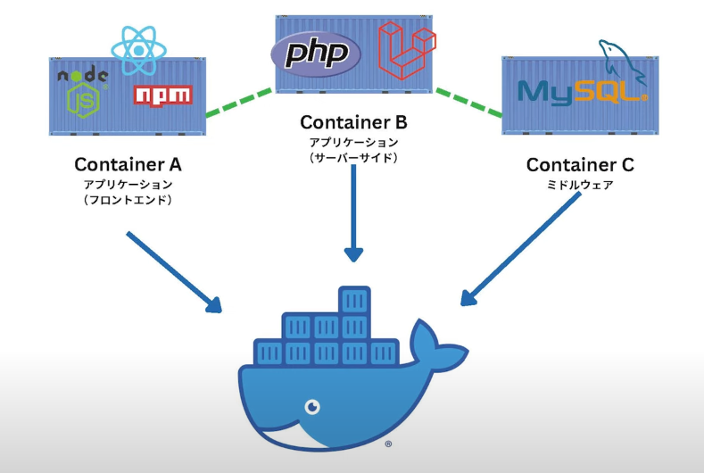
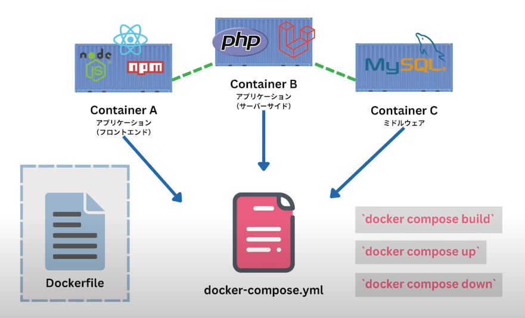
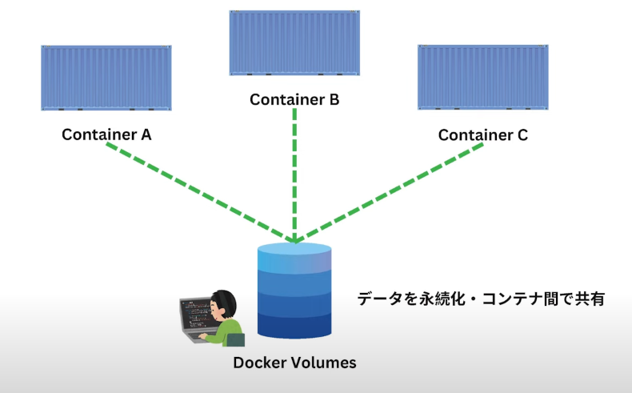

## docker compose

複数のコンテナー起動

## yaml

スペースで階層を表現するファイル形式

```
version: "3"
services:
  web:
    build: ./php
  db:
    image:mariadb: 10.4
```

* パスは相対パスで書く

## imageと build

コンテナーイメージ指定

+ image -> DockerHubから指定
+ build -> Dockerfileのパスを指定

## container_name

docker run --name と同じ

```
version: "3"
services:
  web:
    image: php8.0
    container_name: "php8"
  db:
    container_name: "db2"
```

## volume

docker run -v と同じ

```
version: "3"
services:
  web:
  db:
    volume:
      ./data:/var/lib/mysql
```

## ports

+ docker run -p と同じ
+ ポートは改行が必要
  
```
version: "3"
services:
  web:
    image: php8.0
    ports:
      "8080:80"
  db:
```

## wordpress 構築 例
```
version: "3"
services:
  db:
    image: mariadb:10.4
    container_name: "wordpress-db"
    volumes:
      - ./db-data:/var/lib/mysql
    environment:
      MYSQL_ROOT_PASSWORD: root
      MYSQL_DATABASE: wordpress
      MYSQL_USER: wordpress
      MYSQL_PASSWORD: wordpress
    
  wordpress:
    image: wordpress:5
    container_name: "wordpress-wp"
    volumes:
      - ./wp-data:/var/www/html
    ports:
      - "8000:80"
    environment:
      WORDPRESS_DB_HOST: db:3306#db→内部IPに変換
      WORDPRESS_DB_USER: wordpress
      WORDPRESS_DB_PASSWORD: wordpress
      WORDPRESS_DB_NAME: wordpress
```

## よく使うコマンド

### docker-compose up

コンテナー起動

### docker-compose down

停止 & 削除

### docker-compose restart

コンテナー再起動

### docker-compose ps

コンテナーリスト表示

### docker-compose run

docker-compose.ymlから管理されるサービスを一つ指定してコマンド実行

